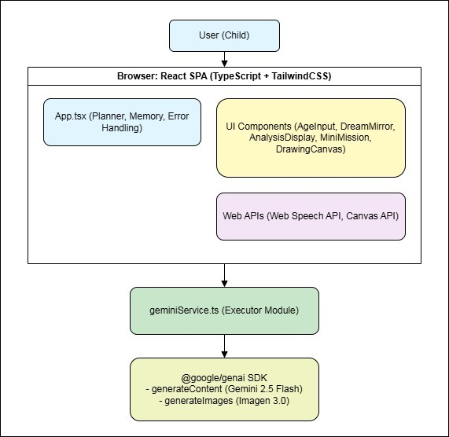

# Architecture Overview

## Components

### User Interface

*   **Framework**: A browser-based Single Page Application (SPA) built with **React** and **TypeScript**.
*   **Styling**: **TailwindCSS** with dynamic theming based on user age, managed via CSS variables.
*   **Entry Point**: `index.html` loads the React app via `index.tsx`.
*   **Core Controller**: `App.tsx` is the central component. It functions as a state machine, managing the `appState` enum to control which view (e.g., `AgeInput`, `DreamMirror`, `AnalysisDisplay`) is rendered. It holds all session state and orchestrates the application flow.
*   **Specialized Inputs**: The app uses the browser's **Web Speech API** for voice-to-text transcription in the `DreamMirror` component and a custom `<canvas>` component (`DrawingCanvas`) for user drawings.

### Agent Core

The "agent" logic is not a continuous loop but is distributed between the UI controller and a dedicated service module.

*   **Planner**: The `App.tsx` component serves as the planner. It determines the sequence of operations based on user input and the current `appState`. For example, after the user submits their age, it transitions the state to `DREAM_INPUT`. After analysis, it transitions to `RESULTS_DISPLAY`. It plans the user's journey through the application's features.
*   **Executor**: The `services/geminiService.ts` module is the primary executor. It contains all the logic for interacting with the Gemini API.
    *   It constructs detailed system instructions and user prompts tailored to the user's age.
    *   It defines rigid **JSON schemas** (`responseSchema`) to enforce structured, reliable output from the `gemini-2.5-flash` model for analysis, game generation, and planning.
    *   It calls the `imagen-3.0-generate-002` model to generate all visual assets dynamically, from career path illustrations to icons for the growth map.
*   **Memory**: The application uses short-term, session-based memory. All user data (`userAge`, `dreamText`, `analysisResult`, `unlockedSkills`, etc.) is stored in the React state within the `App.tsx` component. This memory is cleared when the user resets the app or refreshes the page. There is no long-term persistence or vector database.

### Tools / APIs

*   **Google Gemini API (`@google/genai`)**: This is the core external tool used for all generative tasks.
    *   `ai.models.generateContent`: Used with the `gemini-2.5-flash` model for all text and structured data generation, including dream analysis, story creation, mission design, and generating the real-world action plan.
    *   `ai.models.generateImages`: Used with the `imagen-3.0-generate-002` model to create all images in the application on-the-fly.
*   **Browser APIs**:
    *   **Web Speech API**: For voice-to-text input.
    *   **Canvas API**: For the drawing surface.

### Observability

*   **Logging**: `console.error` and `console.warn` are used within `catch` blocks in both `App.tsx` and `geminiService.ts` to log detailed errors during API calls or data processing.
*   **Error Handling & Retries**:
    *   **UI-Level**: The `App.tsx` component has a centralized `handleError` function that catches errors from services, sets a user-friendly error message in the state, and switches the UI to a dedicated `AppState.ERROR` view.
    *   **API-Level**: The `generateImage` function in `geminiService.ts` implements a robust retry mechanism with **exponential backoff and jitter** to gracefully handle rate-limiting errors (e.g., 429) from the Gemini API, improving the reliability of image generation.
